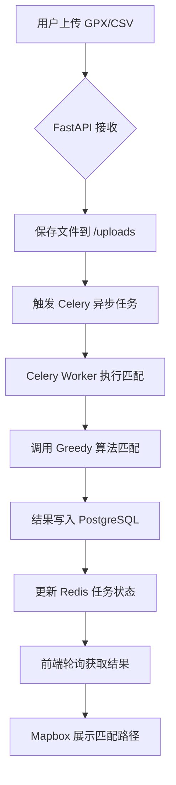

# **轨迹路径匹配系统可行性技术文档**  
> **版本：1.0**  
> **编制团队：2人开发 + AI Agent 协助**  
> **目标**：构建一个可验证、易扩展、支持多算法演进的轨迹地图匹配系统  

---

## 一、系统概述

本系统旨在实现将 GPS 轨迹点序列智能匹配到道路网络上的功能，支持可视化展示与多算法融合。系统采用轻量级架构，兼顾当前快速验证需求与未来扩展能力。

### 核心功能
- ✅ 支持上传 `.gpx` / `.csv` 格式轨迹文件
- ✅ 基于天地图道路数据（Shapefile）进行路径匹配
- ✅ 使用 PostgreSQL + PostGIS 存储与空间计算
- ✅ 初始使用“最近邻匹配”算法（Greedy），后续可扩展 HMM 等高级算法
- ✅ Web UI 展示原始轨迹与匹配结果
- ✅ 异步任务处理（通过 Redis + Celery）
- ✅ 使用 `uv` 管理 Python 依赖（现代替代 pip）

---

## 二、技术栈选型说明

| 模块 | 技术 | 选型理由 |
|------|------|----------|
| **前端** | React + Mapbox GL JS | 成熟的地图可视化方案，支持 GeoJSON 渲染 |
| **后端** | FastAPI (Python) | 快速构建 API，自动生成文档，异步支持好 |
| **数据库** | PostgreSQL + PostGIS | 工业级空间数据库，支持复杂 GIS 运算 |
| **缓存/消息队列** | Redis | 支持异步任务、结果缓存、进度推送 |
| **算法引擎** | Python (Shapely, GeoPandas) | 易于实现和替换匹配算法 |
| **依赖管理** | `uv` | 比 `pip` 更快的现代 Python 包管理器 |
| **部署** | Docker Compose | 零环境冲突，一键启动所有服务 |

---

## 三、系统架构图

```text
+------------------+     +---------------------+
|     Web UI       | ↔️  |    FastAPI Server   |
| (React + Mapbox) |     | (Python + uv)       |
+------------------+     +----------+----------+
                                    |
        +---------------------------+------------------------+
        |                           |                        |
        v                           v                        v
+------------------+    +----------------------+    +-----------------------+
|   PostgreSQL     |    |       Redis          |    |      Celery Worker    |
| (PostGIS 扩展)   |    | (任务队列/缓存)       |    | (异步执行匹配任务)     |
+------------------+    +----------------------+    +-----------------------+
```

> 📌 所有组件通过 `docker-compose` 统一编排，本地开发与部署一致。

---

## 四、环境配置与初始化指令

以下为完整环境搭建流程，适用于 macOS/Linux/Windows (WSL)。

### 1. 安装基础工具

```bash
# 1. 安装 Docker 和 Docker Compose
# macOS: https://docs.docker.com/desktop/
# Linux:
curl -fsSL https://get.docker.com | sh
sudo systemctl start docker

# 2. 安装 uv（Python 依赖管理器）
curl --proto '=https' --tlsv1.2 -sSf https://install.python-poetry.org | python3 -
# 或使用官方安装脚本（参考：https://github.com/astral-sh/uv）
```

### 2. 创建项目结构

```bash
mkdir trajectory-matcher && cd trajectory-matcher
mkdir data uploads backend frontend
```

### 3. 初始化 Docker 环境（`docker-compose.yml`）

```yaml
version: '3.8'
services:
  db:
    image: postgis/postgis:15-3.4
    environment:
      POSTGRES_DB: gisdb
      POSTGRES_USER: postgres
      POSTGRES_PASSWORD: mysecretpassword
    ports:
      - "5432:5432"
    volumes:
      - ./data:/data
      - postgis_data:/var/lib/postgresql/data

  redis:
    image: redis:7-alpine
    ports:
      - "6379:6379"
    volumes:
      - redis_data:/data

  backend:
    build: ./backend
    ports:
      - "8000:8000"
    depends_on:
      - db
      - redis
    volumes:
      - ./uploads:/app/uploads

  worker:
    build: ./backend
    command: celery -A celery_worker.celery_app worker -l info
    depends_on:
      - db
      - redis
    volumes:
      - ./uploads:/app/uploads

volumes:
  postgis_data:
  redis_data:
```

### 4. 启动所有服务

```bash
# 在项目根目录执行
docker-compose up -d
```

> ✅ 此时已启动：PostgreSQL、Redis、FastAPI、Celery Worker

---

## 五、数据库初始化与数据导入

### 1. 进入 PostgreSQL 容器并启用 PostGIS

```bash
docker exec -it trajectory-matcher-db-1 psql -U postgres -d gisdb
```

在 `psql` 中执行：

```sql
CREATE EXTENSION IF NOT EXISTS postgis;
CREATE EXTENSION IF NOT EXISTS postgis_topology;
```

### 2. 导入天地图道路数据（Shapefile）

假设你已将天地图 ZIP 解压至 `./data/roads.shp`

```bash
# 使用 shp2pgsql 导入（在宿主机执行）
shp2pgsql -s 4490 -I ./data/roads.shp public.roads | \
docker exec -i trajectory-matcher-db-1 psql -U postgres -d gisdb
```

> 🔍 注：`4490` 为 CGCS2000 坐标系，适用于中国地区天地图数据

### 3. 创建轨迹表

```sql
-- 创建轨迹元数据表
CREATE TABLE trajectories (
    id SERIAL PRIMARY KEY,
    name TEXT,
    vehicle_id TEXT,
    upload_time TIMESTAMP DEFAULT NOW()
);

-- 创建轨迹点表（带空间索引）
CREATE TABLE track_points (
    id SERIAL PRIMARY KEY,
    traj_id INTEGER REFERENCES trajectories(id),
    time TIMESTAMP,
    geom GEOMETRY(POINT, 4490),
    speed FLOAT,
    INDEX USING GIST (geom)
);
```

---

## 六、核心流程设计

### 1. 轨迹上传与处理流程



### 2. 初始算法：最近邻匹配（Greedy）

- 对每个轨迹点，查询最近的道路线段
- 使用 `ST_ClosestPoint(road_geom, point)` 计算吸附点
- 结果按时间顺序连接成匹配路径

> ✅ 算法简单、实现快、适合 MVP

### 3. 后续扩展方向

| 阶段 | 可扩展内容 |
|------|------------|
| V1.5 | 加入 HMM（隐马尔可夫模型）匹配算法 |
| V2.0 | 实现算法融合（投票/加权） |
| V2.5 | 支持路径规划、拥堵分析等高级功能 |

---

## 七、前后端交互设计

### 1. API 接口（FastAPI 提供）

| 方法 | 路径 | 功能 |
|------|------|------|
| POST | `/upload` | 上传轨迹文件 |
| GET | `/task/{task_id}` | 查询任务状态 |
| GET | `/result/{traj_id}` | 获取匹配结果（GeoJSON） |
| GET | `/roads` | 获取道路数据用于底图 |

### 2. 前端功能

- 文件上传界面
- 地图展示：原始点（蓝色）、匹配路径（红色）
- 任务进度条（基于 Redis 状态）
- 多结果对比视图（未来支持）

---

## 八、运维与依赖管理

### 1. 使用 `uv` 管理 Python 依赖

在 `./backend` 目录下：

```bash
# 初始化项目
uv init

# 添加依赖
uv add fastapi sqlalchemy psycopg2-binary geoalchemy2 celery[redis] geopandas requests

# 安装到容器
# Dockerfile 中使用：RUN uv install
```

### 2. 日志与监控

- 所有服务日志通过 `docker-compose logs` 查看
- 可视化监控待后续引入 Prometheus（非当前阶段必需）

---

## 九、可行性评估

| 维度 | 评估 |
|------|------|
| **技术成熟度** | ⭐⭐⭐⭐⭐ 所有组件均为生产级开源项目 |
| **团队适配性** | ⭐⭐⭐⭐ 只需掌握 Python + SQL + 基础 Docker |
| **开发周期** | 2周内可完成 MVP |
| **扩展性** | 支持算法、UI、性能多维度扩展 |
| **维护成本** | 低，Docker 封装，无外部依赖 |

---

## 十、下一步建议

1. ✅ 执行 `docker-compose up -d` 启动环境
2. ✅ 导入天地图道路数据
3. ✅ 实现最简 API：上传 → 异步匹配 → 返回结果
4. ✅ 开发前端基础地图展示
5. 🔜 后续逐步接入 HMM 等高级算法

---

**文档结束**  
如需生成 `Dockerfile`、`requirements.txt`、API 接口定义或前端原型，请告知，我可立即提供。